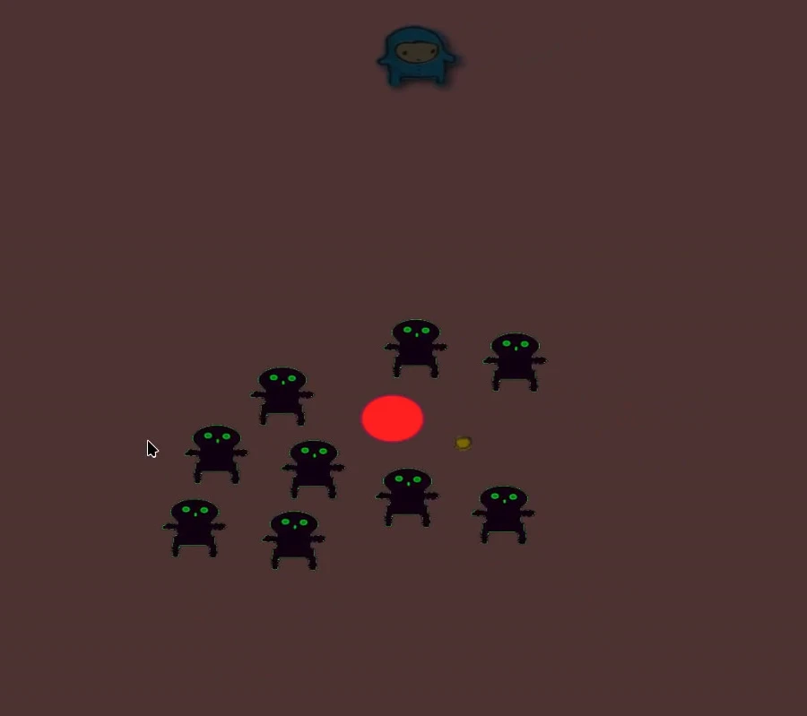
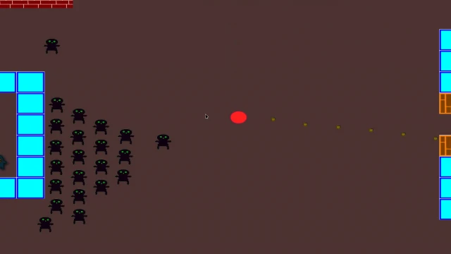

# ZombieGame
Humans vs Zombies C++23 SDL/OpenGL Game
#
* Learning the meson.build system
* Fundamentals of C++23 Programming
* SDL and OpenGL Programming
* Simple Graphic Image Creation

# Installation 
not tested, but build instructions:
```
mkdir -v build
cd build
meson setup ..
ninja
./zombie-game
```
# Credits
Original Game on GitHub [Barnold1953](https://github.com/Barnold1953/GraphicsTutorials/tree/master/ZombieGame) <br>
Youtube Channel [MakingGamesWithBen](https://www.youtube.com/@makinggameswithben)

# Original Tutorial Videos
Available on Youtube 
[Advanced C++ Game Tutorial](https://www.youtube.com/playlist?list=PLSPw4ASQYyymu3PfG9gxywSPghnSMiOAW)

# Screenshots

#

#
